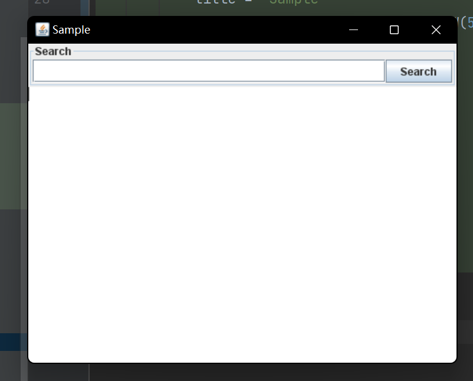

# KtSwing

A simple DSL library for Swing.

|                                   JitPack                                    |                                           Travis-CI                                            |
|:----------------------------------------------------------------------------:|:----------------------------------------------------------------------------------------------:|
| [](https://jitpack.io/#mslxl/KtGUI) | [](https://travis-ci.org/mslxl/KtGUI/) |

## How it looks like
```kotlin
fun searchBar() = swing<JPanel> {
    attr {
        border = TitledBorder("Search")
    }
    borderLayout {
        center {
            textField()
        }
        right {
            button("Search")
        }
    }
}

fun main() =
    frame {
        attr {
            title = "Sample"
            bounds = bounds.withH(400).withW(500)
        }
        borderLayout {
            top {
                panel(searchBar().initBlock)
            }
            center {
                textArea()
            }
        }
    }.exitOnClose
```



## How to use it

**Step 1.** Add the JitPack repository to your build file

Add it in your root build.gradle at the end of repositories:
```groovy
allprojects {
    repositories {
        ...
        maven { url 'https://jitpack.io' }
    }
}
```
**Step 2.** Add the dependency
```groovy
	dependencies {
	        implementation 'com.github.mslxl:KtSwing:Tag'
    }
```
Enjoy it!